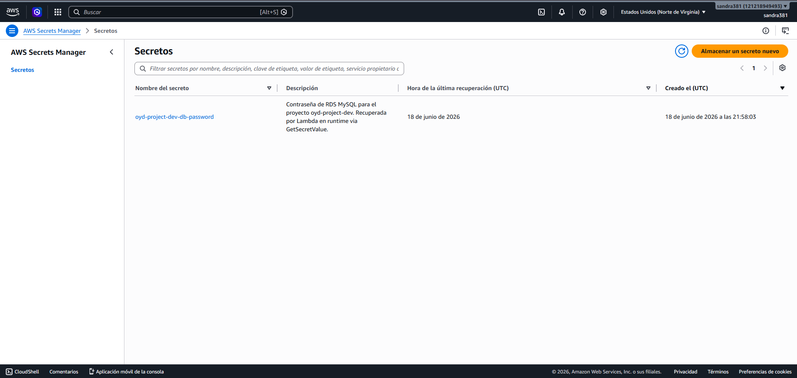
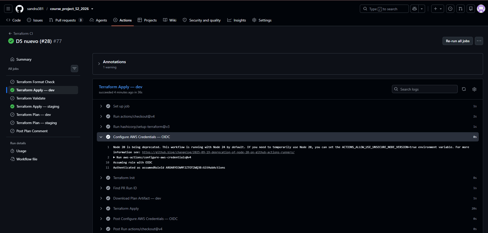
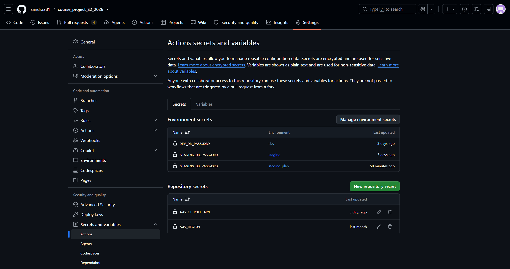
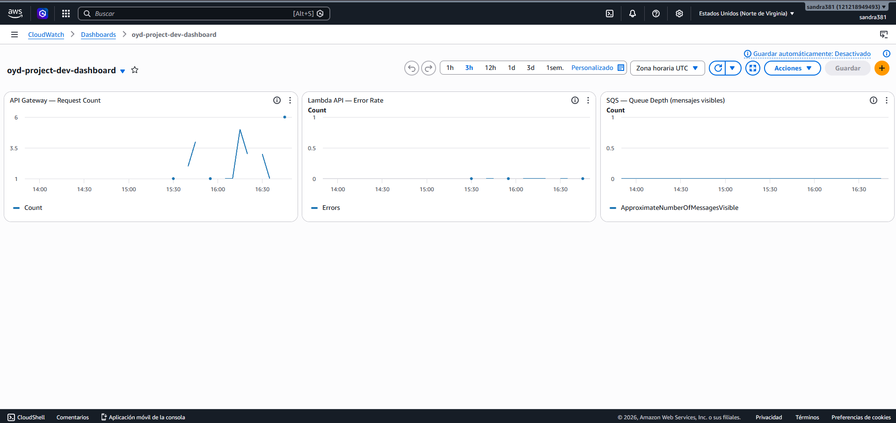
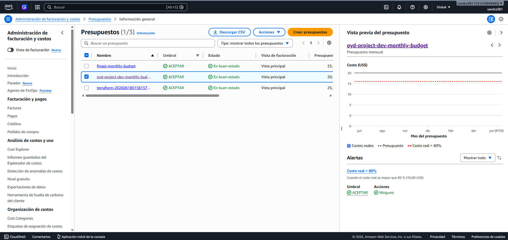
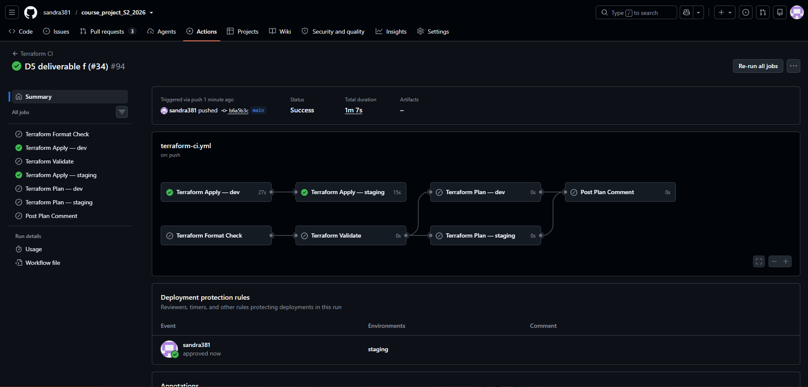
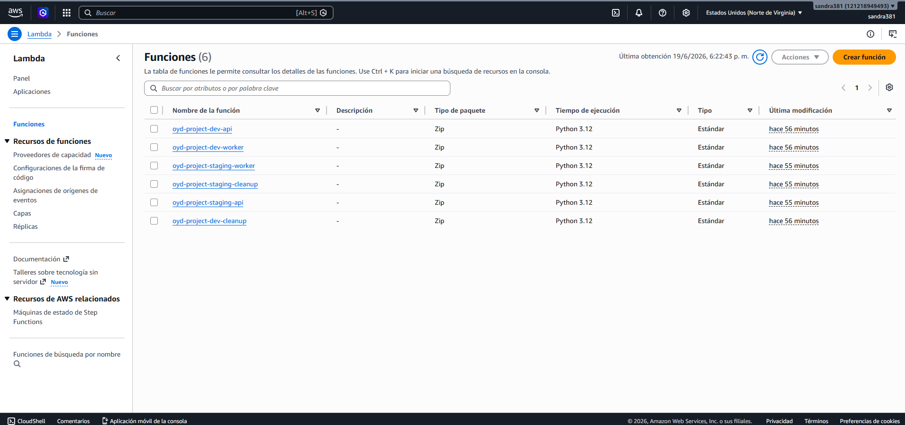

# SPVR — Sistema de Procesamiento de Ventas y Reportes

Infraestructura como código (Terraform) para el proyecto SPVR — Curso de Optimización y Desempeño (OYD), Universidad Galileo.

---

## Arquitectura

```
Internet
   │
   ▼
CloudFront (redirect HTTP→HTTPS, TLS termination)
   │
   ▼
API Gateway (HTTP API)
   │
   ▼
Lambda API ──→ RDS MySQL
   │
   ▼
SQS Queue ──→ Lambda Worker ──→ S3 (reports)
   │
   ▼
DLQ
```

7 componentes: **Compute** (Lambda), **Storage** (S3), **Database** (RDS), **Networking** (VPC), **Async** (SQS), **Security/IAM** (roles, KMS, Secrets Manager), **Observability** (CloudWatch, SNS, Budgets).

---

## Runbook

### 1. Permisos de cuenta requeridos

- Cuenta de AWS con permisos de administrador (o el rol `oyd-project-dev-ci-runner-role` ya provisionado)
- Acceso a GitHub con permisos de administrador del repositorio (para configurar Secrets y Environments)

### 2. GitHub Environments y Secrets a configurar

**Repository secrets** (`Settings → Secrets and Variables → Actions`):
| Secret | Descripción |
|---|---|
| `AWS_CI_ROLE_ARN` | ARN del CI runner role (`arn:aws:iam::<account>:role/oyd-project-dev-ci-runner-role`) |
| `AWS_REGION` | Región de AWS (`us-east-1`) |

**Environment secrets**:
| Environment | Secret | Descripción |
|---|---|---|
| `dev` | `DEV_DB_PASSWORD` | Contraseña de la base de datos RDS de dev |
| `staging` | `STAGING_DB_PASSWORD` | Contraseña de la base de datos RDS de staging |
| `staging-plan` | `STAGING_DB_PASSWORD` | Contraseña de la base de datos RDS de staging |

**Environments a crear** (`Settings → Environments`): `dev`, `staging` (staging con regla de aprobación manual opcional), `staging-plan` .

### 3. Clonar y disparar el pipeline

```bash
git clone https://github.com/sandra381/course_project_S2_2026.git
cd course_project_S2_2026
git checkout -b mi-rama
git commit --allow-empty -m "trigger pipeline"
git push origin mi-rama
# Crear PR hacia main, esperar checks, hacer merge
```

El merge a `main` dispara automáticamente `terraform-apply-dev` (y luego `terraform-apply-staging`), sin intervención manual.

### 4. Verificar que todo está corriendo

```bash
cd infra/
terraform init -reconfigure -backend-config=envs/dev/backend-dev.hcl
terraform output
```

Confirmar que aparecen: `lambda_function_arn`, `db_endpoint`, `vpc_id`, `sqs_queue_arn`, `storage_files_bucket_arn`, `ci_runner_role_arn`, `observability_dashboard_url`.

### 5. Primer arranque de la aplicación (post-infraestructura)

```bash
curl -X POST https://api.grupo1.oyd.solid.com.gt/setup
```

Crea las tablas (`usuarios`, `trabajos`, `reportes`, `errores`, `reportes_vendedor`) y los 9 usuarios de prueba (uno por cada rol: analista, vendedor, gerente, administrador, auditor) con contraseñas hasheadas vía bcrypt.

---

## Evidence

### Deliverable A — IAM Security Module

```
module.iam.aws_iam_role.scheduler_exec: Refreshing state... [id=oyd-project-dev-scheduler-role]
module.iam.aws_iam_role.lambda_cleanup: Refreshing state... [id=oyd-project-dev-lambda-cleanup-role]
module.iam.aws_iam_role.lambda_worker: Refreshing state... [id=oyd-project-dev-lambda-worker-role]
module.iam.aws_iam_role.lambda_api: Refreshing state... [id=oyd-project-dev-lambda-api-role]
module.iam.aws_iam_role.ci_runner: Refreshing state... [id=oyd-project-dev-ci-runner-role]

```
`infra/evidence/iam-plan.txt` — plan de Terraform que muestra todos los roles, políticas y asociaciones de políticas (attachments) de IAM creados por el módulo de IAM.

[Ver evidencia completa aqui](evidence/iam-plan.txt)

### Entregable B — Secrets Manager y KMS
```
db_secret_arn = "arn:aws:secretsmanager:us-east-1:121218949493:secret:oyd-project-dev-db-password-Q5lnbj"
db_secret_name = "oyd-project-dev-db-password"
kms_alias_name = "alias/oyd-project-dev-cmk"
kms_key_arn = "arn:aws:kms:us-east-1:121218949493:key/53dd0626-8f0f-46ed-88ff-8c15b9457c65"
```
`infra/evidence/secrets-kms.txt` — salida de Terraform que muestra el ARN de la llave KMS y el ARN del secreto en Secrets Manager.  [Ver evidencia completa aqui](evidence/secrets-kms.txt)




### Entregable C — Autenticación CI mediante OIDC





### Entregable D — Terminación TLS

```
# HTTPS - conexión segura con certificado válido
$ curl -v https://api.grupo1.oyd.solid.com.gt/
...
* TLSv1.3 handshake completed
* Server certificate:
*   subject: CN=api.grupo1.oyd.solid.com.gt
*   start date: Jun 19 00:00:00 2026 GMT
*   expire date: Jan  2 23:59:59 2027 GMT
*   issuer: C=US; O=Amazon; CN=Amazon RSA 2048 M01
* SSL certificate verified.
...
< HTTP/2 200
< content-type: application/json
{"status": "ok", "service": "spvr-api"}

# HTTP - redirección 301 a HTTPS
$ curl -v http://api.grupo1.oyd.solid.com.gt/
...
< HTTP/1.1 301 Moved Permanently
< Location: https://api.grupo1.oyd.solid.com.gt/
< X-Cache: Redirect from cloudfront
...
<html>...301 Moved Permanently...</html>
```
`infra/evidence/tls-curl.txt` — salida de curl que muestra un handshake TLS exitoso (HTTPS, HTTP/2 200) y una redirección HTTP 301 hacia HTTPS mediante CloudFront.

[Ver evidencia completa aqui](evidence/tls-curl.txt)

**Dominio personalizado:** `https://api.grupo1.oyd.solid.com.gt`
**Arquitectura:** CloudFront (capa de redirección) → API Gateway HTTP API → Lambda
**Certificado:** AWS ACM, región us-east-1 (coincide con la región de API Gateway)


### Entregable E — Módulo de Observabilidad

```
observability_budget_name = "oyd-project-dev-monthly-budget"
observability_dashboard_url = "https://us-east-1.console.aws.amazon.com/cloudwatch/home?region=us-east-1#dashboards:name=oyd-project-dev-dashboard"
observability_lambda_api_errors_alarm_arn = "arn:aws:cloudwatch:us-east-1:121218949493:alarm:oyd-project-dev-lambda-api-errors"
observability_log_group_names = {
observability_sns_topic_arn = "arn:aws:sns:us-east-1:121218949493:oyd-project-dev-alerts"
observability_sqs_queue_depth_alarm_arn = "arn:aws:cloudwatch:us-east-1:121218949493:alarm:oyd-project-dev-sqs-queue-depth"
```
`infra/evidence/observability-outputs.txt` — salida de Terraform que muestra los ARN de los grupos de logs y las alarmas.

[Ver evidencia completa aqui](evidence/observability-outputs.txt)





### Entregable F — Evidencia de Despliegue con un Solo Clic



```
Run terraform apply tfplan-dev
  terraform apply tfplan-dev
  shell: /usr/bin/bash -e {0}
  env:
    TERRAFORM_CLI_PATH: /home/runner/work/_temp/d06a5c9d-11d8-4746-bda5-cb8c421e14c4
    AWS_DEFAULT_REGION: ***
    AWS_REGION: ***
    AWS_ACCESS_KEY_ID: ***
    AWS_SECRET_ACCESS_KEY: ***
    AWS_SESSION_TOKEN: ***
    TF_VAR_db_password: ***

Apply complete! Resources: 0 added, 0 changed, 0 destroyed.

Outputs:

acm_certificate_arn = "arn:aws:acm:***:121218949493:certificate/33abf93c-aee0-40cb-adbd-a97a15050719"
api_endpoint = "https://pt25bi31v0.execute-api.***.amazonaws.com/"
ci_runner_role_arn = "***"
cloudfront_domain_name = "d2id0i8tvjaluk.cloudfront.net"
custom_domain_url = "https://api.grupo1.oyd.solid.com.gt/"
db_endpoint = "oyd-project-dev-db.c4xq80ckagkb.***.rds.amazonaws.com:3306"
db_name = "spvr"
db_secret_arn = "arn:aws:secretsmanager:***:121218949493:secret:oyd-project-dev-db-password-GpBqZF"
db_secret_name = "oyd-project-dev-db-password"
kms_alias_name = "alias/oyd-project-dev-cmk"
kms_key_arn = "arn:aws:kms:***:121218949493:key/bd88caed-c30b-4466-a0d8-be67f9977f94"
lambda_api_role_arn = "arn:aws:iam::121218949493:role/oyd-project-dev-lambda-api-role"
lambda_cleanup_role_arn = "arn:aws:iam::121218949493:role/oyd-project-dev-lambda-cleanup-role"
lambda_function_arn = "arn:aws:lambda:***:121218949493:function:oyd-project-dev-api"
lambda_function_name = "oyd-project-dev-api"
lambda_worker_role_arn = "arn:aws:iam::121218949493:role/oyd-project-dev-lambda-worker-role"
name_servers = []
nat_gateway_ids = [
  "nat-0a3444c26d5708a58",
]
observability_budget_name = "oyd-project-dev-monthly-budget"
observability_dashboard_url = "https://***.console.aws.amazon.com/cloudwatch/home?region=***#dashboards:name=oyd-project-dev-dashboard"
observability_lambda_api_errors_alarm_arn = "arn:aws:cloudwatch:***:121218949493:alarm:oyd-project-dev-lambda-api-errors"
observability_log_group_names = {
  "api" = "/dev/api"
  "cleanup" = "/dev/cleanup"
  "worker" = "/dev/worker"
}
observability_sns_topic_arn = "arn:aws:sns:***:121218949493:oyd-project-dev-alerts"
observability_sqs_queue_depth_alarm_arn = "arn:aws:cloudwatch:***:121218949493:alarm:oyd-project-dev-sqs-queue-depth"
private_subnet_ids = [
  "subnet-073b55085b471caed",
  "subnet-06c1afb7015f1ba80",
]
public_subnet_ids = [
  "subnet-095cf58891c7d7472",
  "subnet-01cac52d451a7c604",
]
sqs_dlq_arn = "arn:aws:sqs:***:121218949493:spvr-jobs-dlq"
sqs_dlq_url = "https://sqs.***.amazonaws.com/121218949493/spvr-jobs-dlq"
sqs_queue_arn = "arn:aws:sqs:***:121218949493:spvr-jobs-queue"
sqs_queue_url = "https://sqs.***.amazonaws.com/121218949493/spvr-jobs-queue"
storage_files_bucket_arn = "arn:aws:s3:::oyd-project-dev-files"
storage_files_bucket_name = "oyd-project-dev-files"
storage_reports_bucket_arn = "arn:aws:s3:::oyd-project-dev-reports"
storage_reports_bucket_name = "oyd-project-dev-reports"
vpc_id = "vpc-0c76e2c3408eec355"
zone_id = "Z09673581TIXT01P7MFT9"
```
[Ver evidencia completa aqui](evidence/terraform-output-full.txt)

`infra/evidence/terraform-output-full.txt` — salida de Terraform después de una ejecución exitosa desde un estado limpio, mostrando los siete componentes en funcionamiento. [Ver en github.](https://github.com/sandra381/course_project_S2_2026/actions/runs/27853515547/job/82436707451)

```
Run terraform plan \
module.compute.data.archive_file.lambda_worker_zip: Reading...
module.compute.data.archive_file.lambda_api_zip: Reading...
module.scheduler.data.archive_file.lambda_cleanup_zip: Reading...
module.scheduler.data.archive_file.lambda_cleanup_zip: Read complete after 0s [id=f7fec281bbd41dc382abc607778af9e386062803]
module.compute.data.archive_file.lambda_worker_zip: Read complete after 0s [id=5274de323db3efcb05e902fb820da4a907e6f878]
module.compute.data.archive_file.lambda_api_zip: Read complete after 0s [id=e7dd5e415d3143f1045d9caeac0d03fd5a76c589]
module.iam.data.aws_caller_identity.current: Reading...
module.iam.data.aws_region.current: Reading...
module.iam.aws_iam_openid_connect_provider.github[0]: Refreshing state... [id=arn:aws:iam::121218949493:oidc-provider/token.actions.githubusercontent.com]
module.iam.data.aws_region.current: Read complete after 0s [id=***]
module.secrets.data.aws_region.current: Reading...
module.secrets.data.aws_caller_identity.current: Reading...
module.storage_files.aws_s3_bucket.this: Refreshing state... [id=oyd-project-dev-files]
aws_acm_certificate.api: Refreshing state... [id=arn:aws:acm:***:121218949493:certificate/33abf93c-aee0-40cb-adbd-a97a15050719]
module.ingress.aws_apigatewayv2_api.this: Refreshing state... [id=pt25bi31v0]
module.secrets.data.aws_region.current: Read complete after 0s [id=***]
module.database.aws_db_parameter_group.this: Refreshing state... [id=oyd-project-dev-mysql8]
aws_s3_bucket.app_assets: Refreshing state... [id=oyd-project-app-assets-dev]
module.iam.aws_iam_role.lambda_cleanup: Refreshing state... [id=oyd-project-dev-lambda-cleanup-role]
module.iam.data.aws_caller_identity.current: Read complete after 0s [id=121218949493]
module.iam.aws_iam_role.lambda_worker: Refreshing state... [id=oyd-project-dev-lambda-worker-role]
module.async.aws_sqs_queue.dlq: Refreshing state... [id=https://sqs.***.amazonaws.com/121218949493/spvr-jobs-dlq]
module.secrets.data.aws_caller_identity.current: Read complete after 0s [id=121218949493]
module.compute.aws_lambda_layer_version.pymysql: Refreshing state... [id=arn:aws:lambda:***:121218949493:layer:oyd-project-dev-pymysql:5]
module.compute.aws_lambda_layer_version.reportlab: Refreshing state... [id=arn:aws:lambda:***:121218949493:layer:oyd-project-dev-reportlab:4]
module.iam.aws_iam_role.lambda_api: Refreshing state... [id=oyd-project-dev-lambda-api-role]
module.iam.aws_iam_role.scheduler_exec: Refreshing state... [id=oyd-project-dev-scheduler-role]
module.network.aws_vpc.this: Refreshing state... [id=vpc-0c76e2c3408eec355]
module.storage_reports.aws_s3_bucket.this: Refreshing state... [id=oyd-project-dev-reports]
module.observability.aws_sns_topic.alerts: Refreshing state... [id=arn:aws:sns:***:121218949493:oyd-project-dev-alerts]
module.observability.data.aws_region.current: Reading...
module.observability.data.aws_region.current: Read complete after 0s [id=***]
module.async.aws_sqs_queue.main: Refreshing state... [id=https://sqs.***.amazonaws.com/121218949493/spvr-jobs-queue]
module.iam.aws_iam_role_policy_attachment.lambda_cleanup_vpc: Refreshing state... [id=oyd-project-dev-lambda-cleanup-role-20260619215219752700000002]
module.ingress.aws_apigatewayv2_stage.default: Refreshing state... [id=$default]
aws_route53_record.cert_validation["api.grupo1.oyd.solid.com.gt"]: Refreshing state... [id=Z09673581TIXT01P7MFT9__524aeb6397020f54032a99b08bde5cef.api.grupo1.oyd.solid.com.gt._CNAME]
module.iam.aws_iam_role_policy.lambda_cleanup_logs: Refreshing state... [id=oyd-project-dev-lambda-cleanup-role:oyd-project-dev-lambda-cleanup-logs]
module.iam.aws_iam_role.ci_runner: Refreshing state... [id=oyd-project-dev-ci-runner-role]
module.iam.aws_iam_role_policy.lambda_worker_logs: Refreshing state... [id=oyd-project-dev-lambda-worker-role:oyd-project-dev-lambda-worker-logs]
module.iam.aws_iam_role_policy_attachment.lambda_worker_vpc: Refreshing state... [id=oyd-project-dev-lambda-worker-role-20260619215219856300000003]
module.iam.aws_iam_role_policy.lambda_api_logs: Refreshing state... [id=oyd-project-dev-lambda-api-role:oyd-project-dev-lambda-api-logs]
module.iam.aws_iam_role_policy_attachment.lambda_api_vpc: Refreshing state... [id=oyd-project-dev-lambda-api-role-20260619215219594300000001]
module.observability.aws_budgets_budget.monthly: Refreshing state... [id=121218949493:oyd-project-dev-monthly-budget]
module.observability.aws_sns_topic_subscription.alerts_email: Refreshing state... [id=arn:aws:sns:***:121218949493:oyd-project-dev-alerts:33b61ca8-48fc-4c05-88d3-4a83656a7361]
aws_s3_bucket_server_side_encryption_configuration.app_assets: Refreshing state... [id=oyd-project-app-assets-dev]
aws_s3_bucket_versioning.app_assets: Refreshing state... [id=oyd-project-app-assets-dev]
module.observability.aws_cloudwatch_metric_alarm.sqs_queue_depth: Refreshing state... [id=oyd-project-dev-sqs-queue-depth]
module.iam.aws_iam_role_policy.lambda_worker_sqs: Refreshing state... [id=oyd-project-dev-lambda-worker-role:oyd-project-dev-lambda-worker-sqs]
module.iam.aws_iam_role_policy.lambda_api_sqs: Refreshing state... [id=oyd-project-dev-lambda-api-role:oyd-project-dev-lambda-api-sqs]
module.secrets.aws_kms_key.main: Refreshing state... [id=bd88caed-c30b-4466-a0d8-be67f9977f94]
aws_acm_certificate_validation.api: Refreshing state... [id=2026-06-19 22:19:26.377 +0000 UTC]
module.storage_files.aws_s3_bucket_lifecycle_configuration.this: Refreshing state... [id=oyd-project-dev-files]
module.storage_files.aws_s3_bucket_versioning.this: Refreshing state... [id=oyd-project-dev-files]
module.storage_files.aws_s3_bucket_public_access_block.this: Refreshing state... [id=oyd-project-dev-files]
module.storage_files.aws_s3_bucket_cors_configuration.this: Refreshing state... [id=oyd-project-dev-files]
aws_cloudfront_distribution.api: Refreshing state... [id=E3MMSK80D3XQPN]
module.storage_files.aws_s3_bucket_policy.this: Refreshing state... [id=oyd-project-dev-files]
module.storage_reports.aws_s3_bucket_lifecycle_configuration.this: Refreshing state... [id=oyd-project-dev-reports]
module.storage_reports.aws_s3_bucket_cors_configuration.this: Refreshing state... [id=oyd-project-dev-reports]
module.storage_reports.aws_s3_bucket_public_access_block.this: Refreshing state... [id=oyd-project-dev-reports]
module.storage_reports.aws_s3_bucket_versioning.this: Refreshing state... [id=oyd-project-dev-reports]
module.secrets.aws_kms_alias.main: Refreshing state... [id=alias/oyd-project-dev-cmk]
module.storage_reports.aws_s3_bucket_policy.this: Refreshing state... [id=oyd-project-dev-reports]
module.iam.aws_iam_role_policy.ci_runner_scheduler: Refreshing state... [id=oyd-project-dev-ci-runner-role:oyd-project-dev-ci-scheduler]
module.iam.aws_iam_role_policy.ci_runner_ec2: Refreshing state... [id=oyd-project-dev-ci-runner-role:oyd-project-dev-ci-ec2]
module.iam.aws_iam_role_policy.ci_runner_state: Refreshing state... [id=oyd-project-dev-ci-runner-role:oyd-project-dev-ci-state]
module.iam.aws_iam_role_policy.ci_runner_apigw: Refreshing state... [id=oyd-project-dev-ci-runner-role:oyd-project-dev-ci-apigw]
module.iam.aws_iam_role_policy.ci_runner_observability: Refreshing state... [id=oyd-project-dev-ci-runner-role:oyd-project-dev-ci-observability]
module.iam.aws_iam_role_policy.lambda_api_s3: Refreshing state... [id=oyd-project-dev-lambda-api-role:oyd-project-dev-lambda-api-s3]
module.iam.aws_iam_role_policy.ci_runner_dns_tls_observability: Refreshing state... [id=oyd-project-dev-ci-runner-role:oyd-project-dev-ci-dns-tls-observability]
module.iam.aws_iam_role_policy.ci_runner_iam: Refreshing state... [id=oyd-project-dev-ci-runner-role:oyd-project-dev-ci-iam]
module.iam.aws_iam_role_policy.ci_runner_secrets_kms: Refreshing state... [id=oyd-project-dev-ci-runner-role:oyd-project-dev-ci-secrets-kms]
module.iam.aws_iam_role_policy.ci_runner_rds: Refreshing state... [id=oyd-project-dev-ci-runner-role:oyd-project-dev-ci-rds]
module.iam.aws_iam_role_policy.ci_runner_sqs: Refreshing state... [id=oyd-project-dev-ci-runner-role:oyd-project-dev-ci-sqs]
module.iam.aws_iam_role_policy.ci_runner_s3_app: Refreshing state... [id=oyd-project-dev-ci-runner-role:oyd-project-dev-ci-s3-app]
module.iam.aws_iam_role_policy_attachment.ci_runner_readonly: Refreshing state... [id=oyd-project-dev-ci-runner-role-20260619215220431300000004]
module.iam.aws_iam_role_policy.lambda_worker_s3: Refreshing state... [id=oyd-project-dev-lambda-worker-role:oyd-project-dev-lambda-worker-s3]
module.iam.aws_iam_role_policy.ci_runner_lambda: Refreshing state... [id=oyd-project-dev-ci-runner-role:oyd-project-dev-ci-lambda]
module.secrets.time_sleep.kms_propagation: Refreshing state... [id=2026-06-19T22:19:21Z]
module.storage_files.aws_s3_bucket_server_side_encryption_configuration.this: Refreshing state... [id=oyd-project-dev-files]
module.storage_reports.aws_s3_bucket_server_side_encryption_configuration.this: Refreshing state... [id=oyd-project-dev-reports]
module.network.aws_internet_gateway.this: Refreshing state... [id=igw-00291b49419d3fcdc]
module.network.aws_security_group.db_sg: Refreshing state... [id=sg-099ac276c8eedb161]
module.network.aws_security_group.app_sg: Refreshing state... [id=sg-0c57900b9630ee4a2]
module.network.aws_subnet.private[0]: Refreshing state... [id=subnet-073b55085b471caed]
module.network.aws_subnet.private[1]: Refreshing state... [id=subnet-06c1afb7015f1ba80]
module.network.aws_subnet.public[1]: Refreshing state... [id=subnet-01cac52d451a7c604]
module.network.aws_subnet.public[0]: Refreshing state... [id=subnet-095cf58891c7d7472]
module.network.aws_security_group.web_sg: Refreshing state... [id=sg-0242e8a30bb96524f]
aws_route53_record.api: Refreshing state... [id=Z09673581TIXT01P7MFT9_api.grupo1.oyd.solid.com.gt_A]
module.secrets.aws_secretsmanager_secret.db_password: Refreshing state... [id=arn:aws:secretsmanager:***:121218949493:secret:oyd-project-dev-db-password-GpBqZF]
module.network.aws_route_table.public: Refreshing state... [id=rtb-052464067c2dd7e0a]
module.network.aws_eip.nat[0]: Refreshing state... [id=eipalloc-0499ccd2c6570440e]
module.network.aws_security_group_rule.db_ingress_from_app: Refreshing state... [id=sgrule-4279227649]
module.network.aws_network_acl.private: Refreshing state... [id=acl-054d6711c0c562200]
module.network.aws_network_acl.public: Refreshing state... [id=acl-026515742c0f5e153]
module.network.aws_security_group_rule.app_ingress_from_web: Refreshing state... [id=sgrule-1797771813]
module.secrets.aws_iam_role_policy.lambda_cleanup_secrets: Refreshing state... [id=oyd-project-dev-lambda-cleanup-role:oyd-project-dev-lambda-cleanup-secrets]
module.secrets.aws_iam_role_policy.lambda_worker_secrets: Refreshing state... [id=oyd-project-dev-lambda-worker-role:oyd-project-dev-lambda-worker-secrets]
module.secrets.aws_secretsmanager_secret_version.db_password: Refreshing state... [id=arn:aws:secretsmanager:***:121218949493:secret:oyd-project-dev-db-password-GpBqZF|terraform-20260619221922063700000007]
module.secrets.aws_iam_role_policy.lambda_api_secrets: Refreshing state... [id=oyd-project-dev-lambda-api-role:oyd-project-dev-lambda-api-secrets]
module.network.aws_route_table_association.public[0]: Refreshing state... [id=rtbassoc-0d4f40636e8db15e2]
module.network.aws_route_table_association.public[1]: Refreshing state... [id=rtbassoc-024b4f5f5dd041509]
module.database.aws_db_subnet_group.this: Refreshing state... [id=oyd-project-dev-subnet-group]
module.network.aws_nat_gateway.this[0]: Refreshing state... [id=nat-0a3444c26d5708a58]
module.network.aws_route_table.private[0]: Refreshing state... [id=rtb-026fd6bb5ad0ded5a]
module.database.aws_db_instance.this: Refreshing state... [id=db-FAKXLMUMR3MUTG6M6EIJJBOUQE]
module.network.aws_route_table_association.private[0]: Refreshing state... [id=rtbassoc-07486fa6ba65ad225]
module.network.aws_route_table_association.private[1]: Refreshing state... [id=rtbassoc-081438976b1b800a4]
module.iam.aws_iam_role_policy.lambda_api_rds: Refreshing state... [id=oyd-project-dev-lambda-api-role:oyd-project-dev-lambda-api-rds]
module.scheduler.aws_lambda_function.cleanup: Refreshing state... [id=oyd-project-dev-cleanup]
module.compute.aws_lambda_function.api: Refreshing state... [id=oyd-project-dev-api]
module.compute.aws_lambda_function.worker: Refreshing state... [id=oyd-project-dev-worker]
module.ingress.aws_apigatewayv2_integration.lambda: Refreshing state... [id=4v6af8i]
module.ingress.aws_lambda_permission.api_gw: Refreshing state... [id=AllowAPIGatewayInvoke]
module.observability.aws_cloudwatch_metric_alarm.lambda_api_errors: Refreshing state... [id=oyd-project-dev-lambda-api-errors]
module.observability.aws_cloudwatch_dashboard.main: Refreshing state... [id=oyd-project-dev-dashboard]
module.compute.aws_lambda_event_source_mapping.sqs_worker: Refreshing state... [id=35a424d0-8678-4f28-86a9-10319158b464]
module.scheduler.aws_iam_role_policy.scheduler_invoke: Refreshing state... [id=oyd-project-dev-scheduler-role:oyd-project-dev-scheduler-invoke-policy]
module.observability.aws_cloudwatch_log_group.lambda["cleanup"]: Refreshing state... [id=/dev/cleanup]
module.observability.aws_cloudwatch_log_group.lambda["api"]: Refreshing state... [id=/dev/api]
module.scheduler.aws_scheduler_schedule.cleanup: Refreshing state... [id=default/oyd-project-dev-cleanup-schedule]
module.observability.aws_cloudwatch_log_group.lambda["worker"]: Refreshing state... [id=/dev/worker]
module.ingress.aws_apigatewayv2_route.get: Refreshing state... [id=sbggy0l]
module.ingress.aws_apigatewayv2_route.post: Refreshing state... [id=zw7ou66]
module.ingress.aws_apigatewayv2_route.root: Refreshing state... [id=nuq5uya]

No changes. Your infrastructure matches the configuration.

Terraform has compared your real infrastructure against your configuration
and found no differences, so no changes are needed.

```
[Ver evidencia completa aqui](evidence/idempotent-plan.txt)

`infra/evidence/idempotent-plan.txt` — segundo plan de Terraform que confirma "No changes" (idempotencia, código de salida 0), verificado mediante GitHub Actions (entorno Linux, fuente oficial para CI/CD). [Ver en github.](https://github.com/sandra381/course_project_S2_2026/actions/runs/27854398178/job/82439082936#step:6:140)

### Entregable I — Cobertura Completa de Infraestructura como Código (IaC)

`infra/docs/iac-coverage.md` — tabla de mapeo de componentes a IaC y declaración de confirmación de recursos administrados. [Ver documento aqui](docs/iac-covarage.md)

```
aws_acm_certificate.api
aws_acm_certificate_validation.api
aws_cloudfront_distribution.api
aws_route53_record.api
aws_route53_record.cert_validation["api.grupo1.oyd.solid.com.gt"]
aws_s3_bucket.app_assets
aws_s3_bucket_server_side_encryption_configuration.app_assets
aws_s3_bucket_versioning.app_assets
module.async.aws_sqs_queue.dlq
module.async.aws_sqs_queue.main
module.compute.data.archive_file.lambda_api_zip
module.compute.data.archive_file.lambda_worker_zip
module.compute.aws_lambda_event_source_mapping.sqs_worker
module.compute.aws_lambda_function.api
module.compute.aws_lambda_function.worker
module.compute.aws_lambda_layer_version.pymysql
module.compute.aws_lambda_layer_version.reportlab
module.database.aws_db_instance.this
module.database.aws_db_parameter_group.this
module.database.aws_db_subnet_group.this
module.iam.data.aws_caller_identity.current
module.iam.data.aws_region.current
module.iam.aws_iam_openid_connect_provider.github[0]
module.iam.aws_iam_role.ci_runner
module.iam.aws_iam_role.lambda_api
module.iam.aws_iam_role.lambda_cleanup
module.iam.aws_iam_role.lambda_worker
module.iam.aws_iam_role.scheduler_exec
module.iam.aws_iam_role_policy.ci_runner_apigw
module.iam.aws_iam_role_policy.ci_runner_dns_tls_observability
module.iam.aws_iam_role_policy.ci_runner_ec2
module.iam.aws_iam_role_policy.ci_runner_iam
module.iam.aws_iam_role_policy.ci_runner_lambda
module.iam.aws_iam_role_policy.ci_runner_observability
module.iam.aws_iam_role_policy.ci_runner_rds
module.iam.aws_iam_role_policy.ci_runner_s3_app
module.iam.aws_iam_role_policy.ci_runner_scheduler
module.iam.aws_iam_role_policy.ci_runner_secrets_kms
module.iam.aws_iam_role_policy.ci_runner_sqs
module.iam.aws_iam_role_policy.ci_runner_state
module.iam.aws_iam_role_policy.lambda_api_logs
module.iam.aws_iam_role_policy.lambda_api_rds
module.iam.aws_iam_role_policy.lambda_api_s3
module.iam.aws_iam_role_policy.lambda_api_sqs
module.iam.aws_iam_role_policy.lambda_cleanup_logs
module.iam.aws_iam_role_policy.lambda_worker_logs
module.iam.aws_iam_role_policy.lambda_worker_s3
module.iam.aws_iam_role_policy.lambda_worker_sqs
module.iam.aws_iam_role_policy_attachment.ci_runner_readonly
module.iam.aws_iam_role_policy_attachment.lambda_api_vpc
module.iam.aws_iam_role_policy_attachment.lambda_cleanup_vpc
module.iam.aws_iam_role_policy_attachment.lambda_worker_vpc
module.ingress.aws_apigatewayv2_api.this
module.ingress.aws_apigatewayv2_integration.lambda
module.ingress.aws_apigatewayv2_route.get
module.ingress.aws_apigatewayv2_route.post
module.ingress.aws_apigatewayv2_route.root
module.ingress.aws_apigatewayv2_stage.default
module.ingress.aws_lambda_permission.api_gw
module.network.aws_eip.nat[0]
module.network.aws_internet_gateway.this
module.network.aws_nat_gateway.this[0]
module.network.aws_network_acl.private
module.network.aws_network_acl.public
module.network.aws_route_table.private[0]
module.network.aws_route_table.public
module.network.aws_route_table_association.private[0]
module.network.aws_route_table_association.private[1]
module.network.aws_route_table_association.public[0]
module.network.aws_route_table_association.public[1]
module.network.aws_security_group.app_sg
module.network.aws_security_group.db_sg
module.network.aws_security_group.web_sg
module.network.aws_security_group_rule.app_ingress_from_web
module.network.aws_security_group_rule.db_ingress_from_app
module.network.aws_subnet.private[0]
module.network.aws_subnet.private[1]
module.network.aws_subnet.public[0]
module.network.aws_subnet.public[1]
module.network.aws_vpc.this
module.observability.data.aws_region.current
module.observability.aws_budgets_budget.monthly
module.observability.aws_cloudwatch_dashboard.main
module.observability.aws_cloudwatch_log_group.lambda["api"]
module.observability.aws_cloudwatch_log_group.lambda["cleanup"]
module.observability.aws_cloudwatch_log_group.lambda["worker"]
module.observability.aws_cloudwatch_metric_alarm.lambda_api_errors
module.observability.aws_cloudwatch_metric_alarm.sqs_queue_depth
module.observability.aws_sns_topic.alerts
module.observability.aws_sns_topic_subscription.alerts_email
module.scheduler.data.archive_file.lambda_cleanup_zip
module.scheduler.aws_iam_role_policy.scheduler_invoke
module.scheduler.aws_lambda_function.cleanup
module.scheduler.aws_scheduler_schedule.cleanup
module.secrets.data.aws_caller_identity.current
module.secrets.data.aws_region.current
module.secrets.aws_iam_role_policy.lambda_api_secrets
module.secrets.aws_iam_role_policy.lambda_cleanup_secrets
module.secrets.aws_iam_role_policy.lambda_worker_secrets
module.secrets.aws_kms_alias.main
module.secrets.aws_kms_key.main
module.secrets.aws_secretsmanager_secret.db_password
module.secrets.aws_secretsmanager_secret_version.db_password
module.secrets.time_sleep.kms_propagation
module.storage_files.aws_s3_bucket.this
module.storage_files.aws_s3_bucket_cors_configuration.this
module.storage_files.aws_s3_bucket_lifecycle_configuration.this
module.storage_files.aws_s3_bucket_policy.this
module.storage_files.aws_s3_bucket_public_access_block.this
module.storage_files.aws_s3_bucket_server_side_encryption_configuration.this
module.storage_files.aws_s3_bucket_versioning.this
module.storage_reports.aws_s3_bucket.this
module.storage_reports.aws_s3_bucket_cors_configuration.this
module.storage_reports.aws_s3_bucket_lifecycle_configuration.this
module.storage_reports.aws_s3_bucket_policy.this
module.storage_reports.aws_s3_bucket_public_access_block.this
module.storage_reports.aws_s3_bucket_server_side_encryption_configuration.this
module.storage_reports.aws_s3_bucket_versioning.this
```
`infra/evidence/state-list.txt` — salida completa del comando `terraform state list`. [Ver evidencia aqui](evidence/state-list.txt)



---

## Funcionalidades adicionales de la aplicación

Más allá de los entregables de infraestructura del curso, se implementaron las siguientes funcionalidades de negocio sobre la arquitectura ya provisionada — sin modificar VPC, RDS, API Gateway, S3, CloudFront ni Route53 ya existentes:

### Autenticación con bcrypt + JWT

- Contraseñas almacenadas como hash (`bcrypt`), nunca en texto plano (columna `password_hash` en `usuarios`)
- Tokens de sesión reales (`PyJWT`), con expiración de 8 horas
- Empaquetado como dos Lambda Layers nuevos (`bcrypt`, compilado para Linux x86_64; `pyjwt`, Python puro), agregados únicamente a Lambda API

### Notificación por correo (Amazon SES)

- Lambda Worker envía un correo al analista cuando su reporte está listo, con un enlace de descarga directo (presigned URL, válido 30 minutos)
- Modo Sandbox de SES: remitente y destinatarios de prueba verificados manualmente en consola

### Reporte individual por vendedor

- Nueva tabla `reportes_vendedor`: el Worker calcula, por cada CSV procesado, el desempeño de cada vendedor presente (total vendido, productos, clientes, ranking, top productos)
- Endpoints `GET /seller/dashboard` (resumen acumulado) y `GET /seller/history` (historial completo) expuestos en Lambda API

### Control de acceso por rol

- Analista: ve únicamente sus propios trabajos y reportes (filtrado por `id_usuario`)
- Gerente y Auditor: ven el historial completo de todos los usuarios; el Auditor además puede descargar el CSV original junto al PDF generado, sin permisos de modificación
- Administrador: panel de monitoreo con métricas y registro de errores en tiempo real

---

## Documentación

- [Delivery 1 — Resumen](docs/delivery-1-summary.md)
- [Delivery 2 — Resumen](docs/delivery-2-summary.md)
- [Delivery 3 — Resumen](docs/delivery-3-summary.md)
- [Delivery 4 — Resumen](docs/delivery-4-summary.md)
- [Delivery 5 — Resumen](docs/delivery-5-summary.md)
---

## Team

- Gabriela Lucia Navarro de León — 20000127
- Diego Alejandro Sican Olivares — 19001690
- Sandra Daniela Soria Palma — 20002619


Universidad Galileo — Postgrado en Diseño y Desarrollo de Software