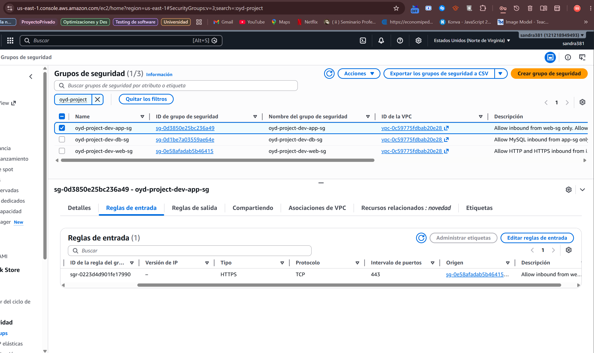
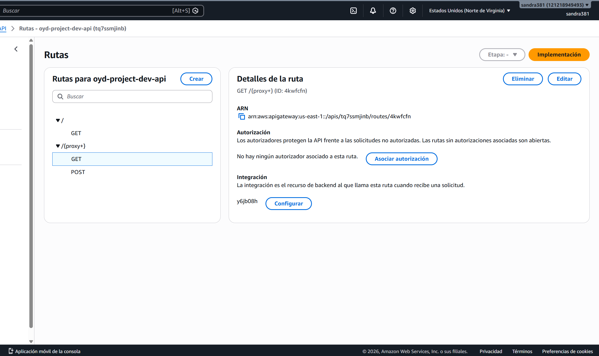
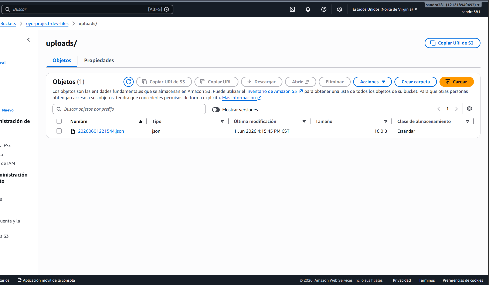
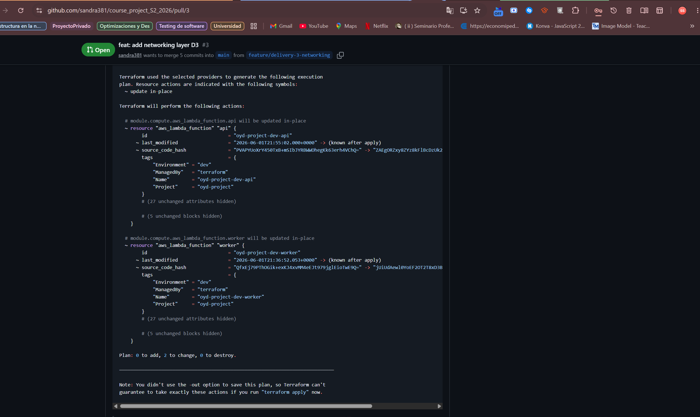

# SPVR — Infrastructure

Sistema de Procesamiento de Ventas y Reportes (SPVR)
Proyecto académico — Universidad Galileo, Postgrado en Diseño y Desarrollo de Software.

## Stack

| Componente | Servicio |
|---|---|
| Cloud Provider | AWS |
| Compute | AWS Lambda (Python 3.12) |
| Database | Amazon RDS MySQL 8.0 |
| Storage | Amazon S3 |
| Networking | VPC custom con subnets públicas y privadas |
| Ingress | API Gateway HTTP API |
| IaC | Terraform ~> 1.8 |
| CI/CD | GitHub Actions |

## Estructura del repositorio

```
infra/
├── main.tf                  — root module, llama a todos los módulos
├── variables.tf             — variables del root module
├── outputs.tf               — outputs del root module
├── backend.tf               — backend S3 para remote state
├── provider.tf              — AWS provider
├── modules/
│   ├── network/             — VPC, subnets, IGW, NAT, SGs, NACLs
│   ├── compute/             — Lambda API y Lambda Worker
│   ├── database/            — RDS MySQL
│   ├── storage/             — S3 buckets
│   └── ingress/             — API Gateway HTTP API
├── database/
│   └── schema.sql           — schema y seed data de la DB
├── docs/
│   └── delivery-3-summary.md
├── envs/
│   └── dev/
│       └── dev.tfvars       — valores del ambiente dev
└── evidence/
    ├── network-foundation.txt
    ├── security-groups-plan.txt
    ├── security-groups.png
    ├── ingress-curl.txt
    ├── ingress-healthy.png
    ├── e2e-get.txt
    ├── e2e-post.txt
    ├── e2e-storage.png
    └── ci-plan.png
```

## Módulos

### `modules/network`
Provisiona la VPC completa con subnets públicas y privadas, Internet Gateway, NAT Gateway, route tables y security groups (web-sg, app-sg, db-sg) con reglas SG-to-SG.

### `modules/compute`
Provisiona dos funciones Lambda: `oyd-project-dev-api` (maneja solicitudes del frontend) y `oyd-project-dev-worker` (procesa archivos CSV). Ambas corren en subnets privadas con el `app-sg`.

### `modules/database`
Provisiona una instancia RDS MySQL 8.0 (`db.t3.micro`) en subnets privadas con el `db-sg`.

### `modules/storage`
Provisiona dos buckets S3: uno para archivos CSV y otro para reportes PDF.

### `modules/ingress`
Provisiona un API Gateway HTTP API con integración Lambda proxy, rutas GET y POST, y stage `$default`.

## Comandos

```bash
# Inicializar
cd infra/
terraform init

# Plan
terraform plan -var-file=envs/dev/dev.tfvars -var="db_password=<password>"

# Apply
terraform apply -var-file=envs/dev/dev.tfvars -var="db_password=<password>"

# Destroy
terraform destroy -var-file=envs/dev/dev.tfvars -var="db_password=<password>"
```

## Endpoints

| Método | Path | Descripción |
|---|---|---|
| GET | `/` | Health check |
| GET | `/jobs` | Lista trabajos desde RDS MySQL |
| POST | `/jobs` | Escribe objeto a S3, retorna 201 |

## Evidence

### Deliverable A — Network Foundation

Output de `terraform output` mostrando VPC ID, subnet IDs y NAT Gateway IDs:

```
api_endpoint = "https://tq7ssmjinb.execute-api.us-east-1.amazonaws.com/"
db_endpoint = "oyd-project-dev-db.c4xq80ckagkb.us-east-1.rds.amazonaws.com:3306"
db_name = "spvr"
lambda_function_arn = "arn:aws:lambda:us-east-1:121218949493:function:oyd-project-dev-api"
lambda_function_name = "oyd-project-dev-api"
nat_gateway_ids = [
  "nat-0e55f11c3ae4ecc29",
]
private_subnet_ids = [
  "subnet-0802e5de8db9be059",
  "subnet-05ff07765aed58825",
]
public_subnet_ids = [
  "subnet-07717579197f633e0",
  "subnet-05de1763255e40b45",
]
storage_files_bucket_arn = "arn:aws:s3:::oyd-project-dev-files"
storage_files_bucket_name = "oyd-project-dev-files"
storage_reports_bucket_arn = "arn:aws:s3:::oyd-project-dev-reports"
storage_reports_bucket_name = "oyd-project-dev-reports"
vpc_id = "vpc-0c59775fdbab20e28"

```

Full output: [evidence/network-foundation.txt](evidence/network-foundation.txt)

---

### Deliverable B — Network Security

Terraform plan excerpt mostrando los security groups y reglas SG-to-SG:

[evidence/security-groups-plan.txt](evidence/security-groups-plan.txt)

Screenshot de los security groups en la consola AWS:



---

### Deliverable C — Public Ingress Layer

curl al API Gateway mostrando respuesta 200:

[evidence/ingress-curl.txt](evidence/ingress-curl.txt)

Screenshot del API Gateway en consola AWS mostrando rutas e integración Lambda:



---

### Deliverable D — End-to-End Connectivity Proof

**GET /jobs** — Lee desde RDS MySQL y retorna JSON:

[evidence/e2e-get.txt](evidence/e2e-get.txt)

**POST /jobs** — Escribe a S3 y retorna HTTP 201:

[evidence/e2e-post.txt](evidence/e2e-post.txt)

Screenshot del objeto creado en el bucket S3:



---

### Deliverable E — CI Pipeline Integration

PR donde el plan corrió y fue posteado como comentario:

[PR #3 — feat: add networking layer D3](https://github.com/sandra381/course_project_S2_2026/pull/3)

Screenshot del workflow corriendo exitosamente:



---
## Documentación

- [Delivery 1 — Resumen](docs/delivery-1-summary.md)
- [Delivery 2 — Resumen](docs/delivery-2-summary.md)
- [Delivery 3 — Resumen](docs/delivery-3-summary.md)
---

## Team

- Gabriela Lucia Navarro de León — 20000127
- Diego Alejandro Sican Olivares — 19001690
- Sandra Daniela Soria Palma — 20002619

Universidad Galileo — Postgrado en Diseño y Desarrollo de Software
Infraestructura en la Nube — Ciclo Mayo–Junio 2026