# SPVR — Infrastructure

Sistema de Procesamiento de Ventas y Reportes (SPVR)
Proyecto académico — Universidad Galileo, Postgrado en Diseño y Desarrollo de Software.

## Stack

| Componente | Servicio |
|---|---|
| Cloud Provider | AWS |
| Compute | AWS Lambda (Python 3.12) |
| Database | Amazon RDS MySQL 8.0 |
| Storage | Amazon S3 |
| Messaging | Amazon SQS (queue + DLQ) |
| Scheduling | Amazon EventBridge Scheduler |
| Networking | VPC custom con subnets públicas y privadas |
| Ingress | API Gateway HTTP API |
| IaC | Terraform ~> 1.8 |
| CI/CD | GitHub Actions |

## Estructura del repositorio

```
infra/
├── main.tf                       — root module, llama a todos los módulos
├── variables.tf                  — variables del root module
├── outputs.tf                    — outputs del root module
├── backend.tf                    — backend S3 para remote state
├── provider.tf                   — AWS provider
├── modules/
│   ├── network/                  — VPC, subnets, IGW, NAT, SGs, NACLs
│   ├── compute/                  — Lambda API, Lambda Worker, event source mapping
│   ├── database/                 — RDS MySQL
│   ├── storage/                  — S3 buckets (archivos y reportes)
│   ├── ingress/                  — API Gateway HTTP API
│   ├── async/                    — SQS queue + DLQ con redrive_policy
│   └── scheduler/                — EventBridge Scheduler (cleanup-stale-jobs)
├── database/
│   └── schema.sql                — schema y seed data de la DB
├── docs/
│   ├── delivery-1-summary.md
│   ├── delivery-2-summary.md
│   ├── delivery-3-summary.md
│   └── delivery-4-summary.md
├── envs/
│   ├── dev/
│   │   ├── dev.tfvars             — valores del ambiente dev
│   │   └── backend-dev.hcl        — backend remoto de dev
│   └── staging/
│       ├── staging.tfvars         — valores del ambiente staging
│       └── backend-staging.hcl    — backend remoto de staging
└── evidence/
    ├── network-foundation.txt
    ├── security-groups-plan.txt
    ├── security-groups.png
    ├── ingress-curl.txt
    ├── ingress-healthy.png
    ├── e2e-get.txt
    ├── e2e-post.txt
    ├── e2e-storage.png
    ├── ci-plan.png
    ├── async-foundation.txt
    ├── event-source-plan.txt
    ├── event-source.png
    ├── scheduler-plan.txt
    ├── scheduler.png
    ├── github-environments.png
    ├── ci-apply-dev.png
    ├── ci-apply-staging.png
    ├── ci-destroy.png
    ├── ci-drift.png
    ├── ruleset-config.png
    ├── ruleset-blocked-merge.png
    ├── async-enqueue.txt
    ├── async-consumer.png
    └── async-object.png
```

## Módulos

### `modules/network`
Provisiona la VPC completa con subnets públicas y privadas, Internet Gateway, NAT Gateway, route tables y security groups (web-sg, app-sg, db-sg) con reglas SG-to-SG.

### `modules/compute`
Provisiona dos funciones Lambda: `oyd-project-<env>-api` (maneja solicitudes del frontend y encola jobs en SQS) y `oyd-project-<env>-worker` (procesa archivos CSV, genera reportes PDF con pandas/reportlab y los escribe en S3). El Worker está conectado a la cola SQS mediante un `aws_lambda_event_source_mapping`. Ambas funciones corren en subnets privadas con el `app-sg`.

### `modules/database`
Provisiona una instancia RDS MySQL 8.0 (`db.t3.micro`) en subnets privadas con el `db-sg`.

### `modules/storage`
Provisiona dos buckets S3: uno para archivos CSV subidos (`<project>-<env>-files`) y otro para reportes PDF generados (`<project>-<env>-reports`).

### `modules/ingress`
Provisiona un API Gateway HTTP API con integración Lambda proxy, rutas GET y POST, y stage `$default`.

### `modules/async`
Provisiona la cola SQS principal (`spvr-jobs-queue`) y su Dead Letter Queue (`spvr-jobs-dlq`), conectadas mediante `redrive_policy` con `max_receive_count = 3`. Expone como outputs las URLs y ARNs de ambas colas, consumidos por `modules/compute` y `modules/scheduler`.

### `modules/scheduler`
Provisiona un `aws_scheduler_schedule` (EventBridge Scheduler) que invoca periódicamente la función Lambda de limpieza `oyd-project-<env>-cleanup`, encargada de marcar como expirados los jobs que llevan más de `var.stale_hours` en estado `PENDIENTE` o `PROCESANDO`. Incluye un rol IAM dedicado, scoped únicamente al ARN de esa función específica.

## Comandos

```bash
# Inicializar (dev)
cd infra/
terraform init -backend-config=envs/dev/backend-dev.hcl

# Plan (dev)
terraform plan -var-file=envs/dev/dev.tfvars -var="db_password=<password>"

# Apply (dev)
terraform apply -var-file=envs/dev/dev.tfvars -var="db_password=<password>"

# Inicializar (staging) — requiere -reconfigure si ya se inicializó dev en el mismo workspace local
terraform init -reconfigure -backend-config=envs/staging/backend-staging.hcl

# Plan / Apply (staging)
terraform plan -var-file=envs/staging/staging.tfvars -var="db_password=<password>"
terraform apply -var-file=envs/staging/staging.tfvars -var="db_password=<password>"

# Destroy (gated — solo vía workflow_dispatch en CI, ver terraform-destroy.yml)
terraform destroy -var-file=envs/dev/dev.tfvars -var="db_password=<password>"
```

## Endpoints

| Método | Path | Descripción |
|---|---|---|
| GET | `/` | Health check |
| GET | `/jobs` | Lista trabajos desde RDS MySQL |
| POST | `/upload` | Genera presigned URL para subir CSV a S3, crea job en RDS |
| POST | `/jobs/enqueue` | Encola un job existente en SQS, retorna HTTP 202 + message ID |
| POST | `/setup` | Crea tablas y seed data en RDS (solo desarrollo) |

## CI/CD — Pipeline

El workflow `terraform-ci.yml` implementa:

- **Pull Request** → corren `Terraform Format Check`, `Terraform Validate` y `Terraform Plan` (genera y sube `tfplan-dev` y `tfplan-staging` como artifacts, postea el plan combinado como comentario en el PR).
- **Merge a `main`** → el job `Terraform Apply — dev` corre automáticamente (`environment: dev`, sin aprobación), descarga `tfplan-dev` del run del PR y ejecuta `terraform apply tfplan-dev` sin re-planear.
- **Tras éxito de dev** → el job `Terraform Apply — staging` se pausa esperando aprobación de un reviewer (`environment: staging`), luego descarga `tfplan-staging` y aplica sin re-planear.

Workflows adicionales:
- `terraform-destroy.yml` — solo `workflow_dispatch`, con input `environment` (`dev`/`staging`), imprime confirmación antes de destruir.
- `terraform-drift.yml` — corre en `schedule` (diario), ejecuta `terraform plan -detailed-exitcode` contra el state de dev y publica el resultado en `$GITHUB_STEP_SUMMARY`.

Un repository ruleset en `main` (Active) exige que los tres checks anteriores pasen antes de mergear, requiere que la rama esté actualizada, y bloquea force-push y borrado de la rama.

## Evidence — Delivery 4 (Async Infrastructure & Full CD Pipeline)

### Deliverable A — Async Messaging Module

Output de `terraform output` mostrando la URL y ARN de la cola principal y del DLQ:

```
api_endpoint = "https://200tq8aa9d.execute-api.us-east-1.amazonaws.com/"
db_endpoint = "oyd-project-dev-db.c4xq80ckagkb.us-east-1.rds.amazonaws.com:3306"
db_name = "spvr"
lambda_function_arn = "arn:aws:lambda:us-east-1:121218949493:function:oyd-project-dev-api"
lambda_function_name = "oyd-project-dev-api"
nat_gateway_ids = [
  "nat-0e9502e98f0aba64e",
]
private_subnet_ids = [
  "subnet-0015f9ac45171db3f",
  "subnet-02b1b4960ac15ed38",
]
public_subnet_ids = [
  "subnet-0efe416505ffa8809",
  "subnet-02167d660fe5caafd",
]
sqs_dlq_arn = "arn:aws:sqs:us-east-1:121218949493:spvr-jobs-dlq"
sqs_dlq_url = "https://sqs.us-east-1.amazonaws.com/121218949493/spvr-jobs-dlq"
sqs_queue_arn = "arn:aws:sqs:us-east-1:121218949493:spvr-jobs-queue"
sqs_queue_url = "https://sqs.us-east-1.amazonaws.com/121218949493/spvr-jobs-queue"
storage_files_bucket_arn = "arn:aws:s3:::oyd-project-dev-files"
storage_files_bucket_name = "oyd-project-dev-files"
storage_reports_bucket_arn = "arn:aws:s3:::oyd-project-dev-reports"
storage_reports_bucket_name = "oyd-project-dev-reports"
vpc_id = "vpc-0144a8eb600d17f19"
```

[evidence/async-foundation.txt](evidence/async-foundation.txt)

---

### Deliverable B — Event-Driven Compute

Terraform plan excerpt mostrando el recurso `aws_lambda_event_source_mapping` conectando SQS al Lambda Worker:

```
module.compute.aws_lambda_event_source_mapping.sqs_worker: Refreshing state... [id=43fb7dfc-cafa-42e2-88bf-3ed240acf116]
```

[evidence/event-source-plan.txt](evidence/event-source-plan.txt)

Screenshot de la consola AWS mostrando el trigger SQS conectado al Lambda Worker:

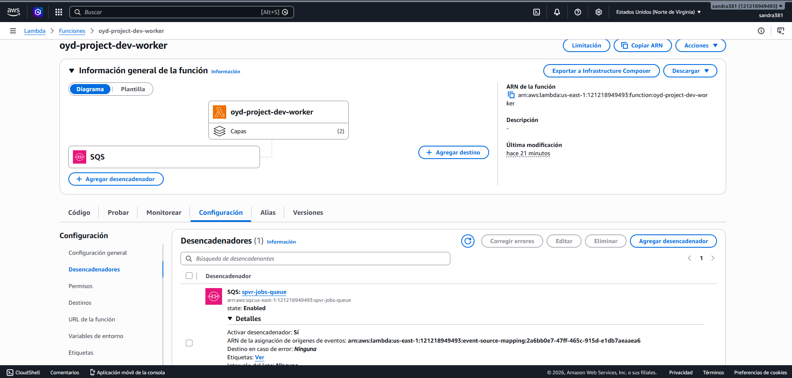

---

### Deliverable C — Scheduled Jobs

Screenshot del EventBridge Scheduler mostrando la regla `oyd-project-dev-cleanup-schedule` activa:

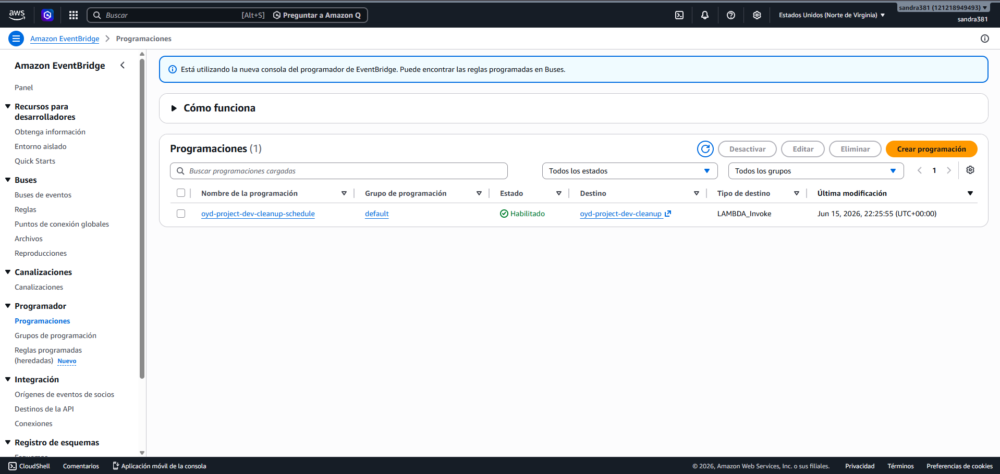

Terraform plan excerpt mostrando el recurso `aws_scheduler_schedule`:
```
module.scheduler.aws_scheduler_schedule.cleanup: Refreshing state... [id=default/oyd-project-dev-cleanup-schedule]
```
[evidence/scheduler-plan.txt](evidence/scheduler-plan.txt)

---

### Deliverable D — Full CD Pipeline

PR donde el workflow de plan corrió sobre los recursos async y posteó el plan combinado (dev + staging) como comentario:

[PR #16 — Fix/staging ok
](https://github.com/sandra381/course_project_S2_2026/pull/16)

Screenshot de Settings → Environments mostrando `dev` (automático) y `staging` (con reviewer requerido):

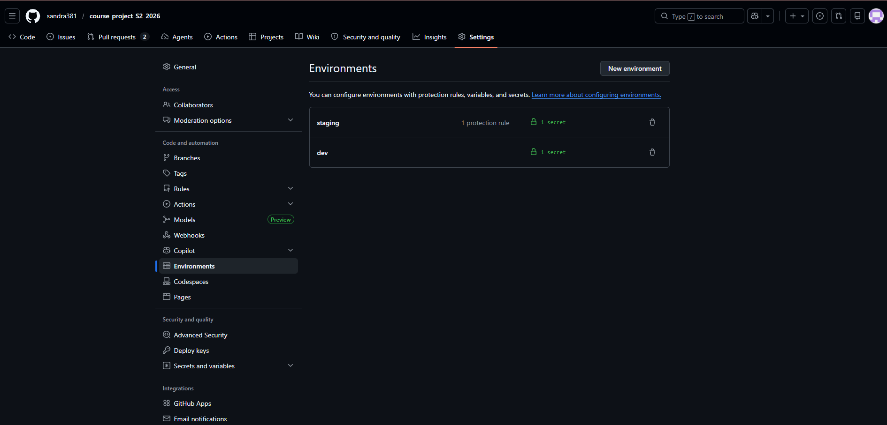

Screenshot del job `Terraform Apply — dev` completando automáticamente tras el merge:

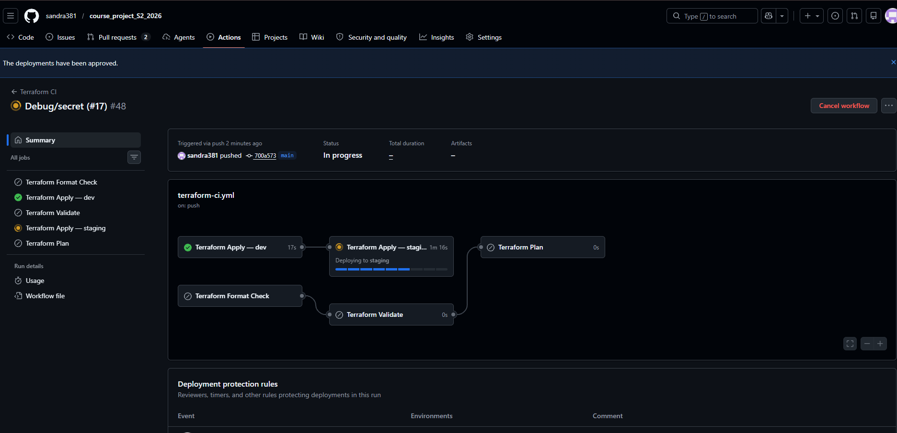

Screenshot del gate de aprobación de `Terraform Apply — staging`, mostrando el reviewer que aprobó:

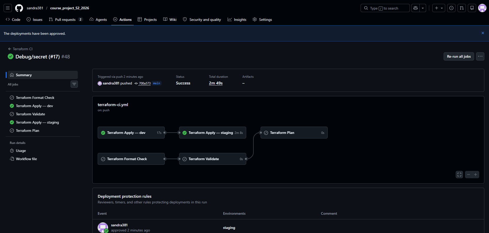

Screenshot del workflow de destroy mostrando el trigger `workflow_dispatch` y el input `environment`:

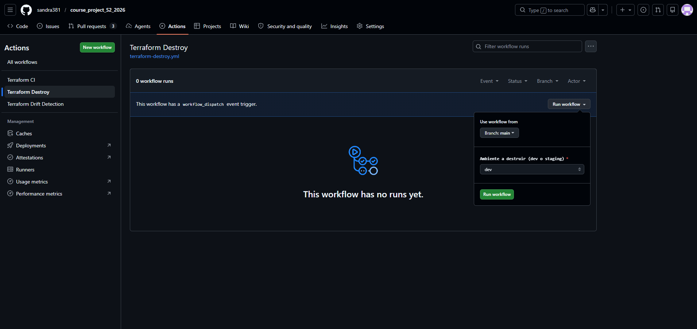

Screenshot del workflow de drift detection mostrando el plan publicado en el step summary:

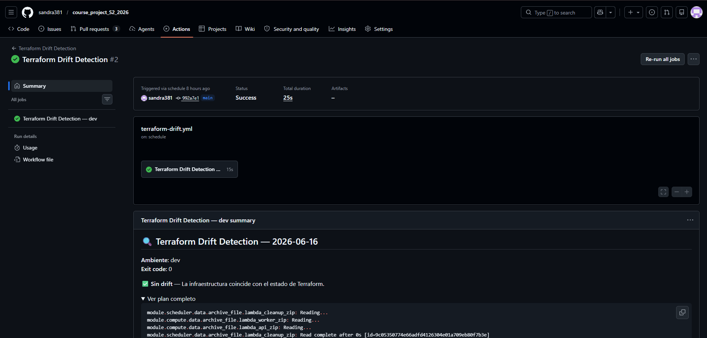

Screenshot de Settings → Rules → Rulesets mostrando el ruleset Active en `main` con los status checks requeridos, branch-up-to-date, block-force-push y block-deletion:

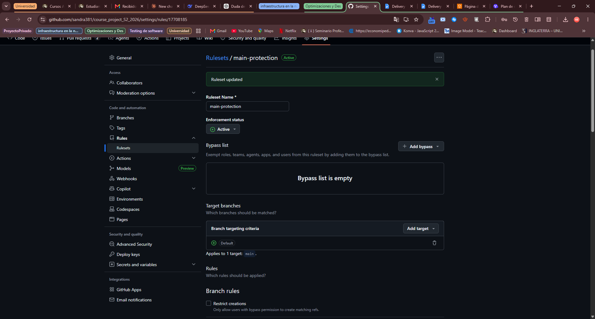

Screenshot de un PR mostrando el merge bloqueado por un check requerido pendiente/fallando y la rama desactualizada respecto a `main`:
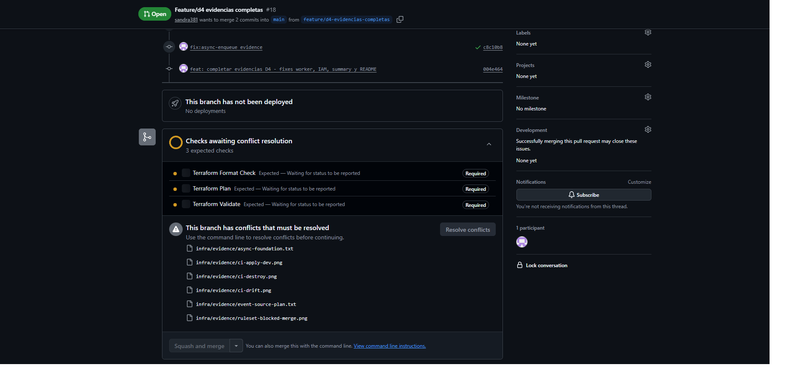

---

### Deliverable E — End-to-End Async Proof

`curl -X POST /jobs/enqueue` mostrando HTTP 202 y el `message_id` real generado por SQS:
```
Note: Unnecessary use of -X or --request, POST is already inferred.
* Host 200tq8aa9d.execute-api.us-east-1.amazonaws.com:443 was resolved.
* IPv6: (none)
* IPv4: 32.196.92.18, 54.208.231.71
*   Trying 32.196.92.18:443...
* ALPN: curl offers h2,http/1.1
* TLSv1.3 (OUT), TLS handshake, Client hello (1):
* SSL Trust Anchors:
*   Native: Windows System Stores ROOT+CA
* TLSv1.3 (IN), TLS handshake, Server hello (2):
* TLSv1.3 (IN), TLS handshake, Unknown (8):
* TLSv1.3 (IN), TLS handshake, Certificate (11):
* TLSv1.3 (IN), TLS handshake, CERT verify (15):
* TLSv1.3 (IN), TLS handshake, Finished (20):
* TLSv1.3 (OUT), TLS handshake, Finished (20):
* SSL connection using TLSv1.3 / TLS_AES_128_GCM_SHA256 / [blank] / UNDEF
* ALPN: server accepted h2
* Server certificate:
*   subject: CN=*.execute-api.us-east-1.amazonaws.com
*   start date: Apr 22 00:00:00 2026 GMT
*   expire date: Nov  5 23:59:59 2026 GMT
*   issuer: C=US; O=Amazon; CN=Amazon RSA 2048 M01
*   Certificate level 0: Public key type ? (2048/112 Bits/secBits), signed using sha256WithRSAEncryption
*   Certificate level 1: Public key type ? (2048/112 Bits/secBits), signed using sha256WithRSAEncryption
*   Certificate level 2: Public key type ? (2048/112 Bits/secBits), signed using sha256WithRSAEncryption
*   Certificate level 3: Public key type ? (2048/112 Bits/secBits), signed using sha256WithRSAEncryption
*   subjectAltName: "200tq8aa9d.execute-api.us-east-1.amazonaws.com" matches cert's "*.execute-api.us-east-1.amazonaws.com"
* OpenSSL verify result: 0
* SSL certificate verified via OpenSSL.
* Established connection to 200tq8aa9d.execute-api.us-east-1.amazonaws.com (32.196.92.18 port 443) from 192.168.0.11 port 52057 
* using HTTP/2
* [HTTP/2] [1] OPENED stream for https://200tq8aa9d.execute-api.us-east-1.amazonaws.com/jobs/enqueue
* [HTTP/2] [1] [:method: POST]
* [HTTP/2] [1] [:scheme: https]
* [HTTP/2] [1] [:authority: 200tq8aa9d.execute-api.us-east-1.amazonaws.com]
* [HTTP/2] [1] [:path: /jobs/enqueue]
* [HTTP/2] [1] [user-agent: curl/8.19.0]
* [HTTP/2] [1] [accept: */*]
* [HTTP/2] [1] [content-type: application/json]
* [HTTP/2] [1] [content-length: 27]
> POST /jobs/enqueue HTTP/2
> Host: 200tq8aa9d.execute-api.us-east-1.amazonaws.com
> User-Agent: curl/8.19.0
> Accept: */*
> Content-Type: application/json
> Content-Length: 27
> 
* upload completely sent off: 27 bytes
< HTTP/2 202 
< date: Wed, 17 Jun 2026 18:08:23 GMT
< content-type: application/json
< content-length: 89
< apigw-requestid: fHhXtiMtIAMEMow=
< 
{"message_id": "a56f0462-3709-4c00-a560-8c535aaea0be", "job_id": 3, "status": "enqueued"}* Connection #0 to host 200tq8aa9d.execute-api.us-east-1.amazonaws.com:443 left intact
```
[evidence/async-enqueue.txt](evidence/async-enqueue.txt)

Screenshot de CloudWatch Logs mostrando al Lambda Worker procesando el mensaje (`[worker] Procesando job_id=... message_id=...`):

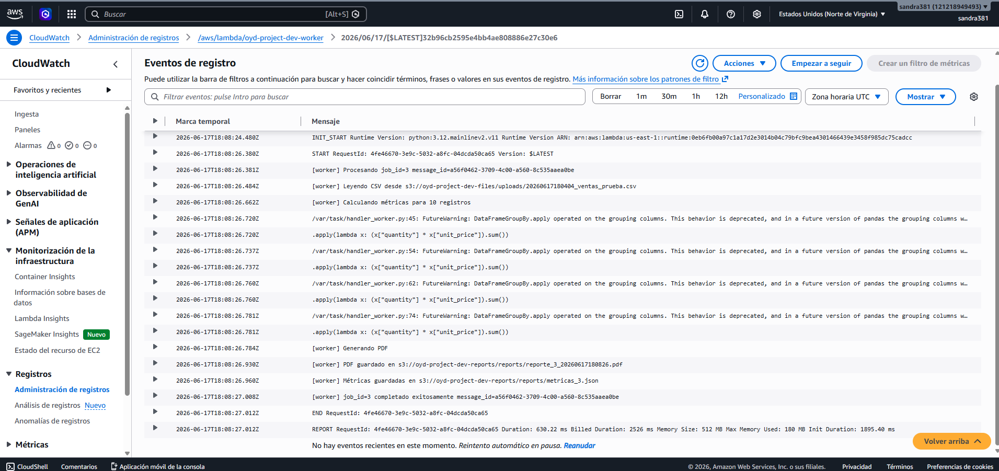

Screenshot del bucket S3 `oyd-project-dev-reports` mostrando el objeto PDF generado por el Worker:

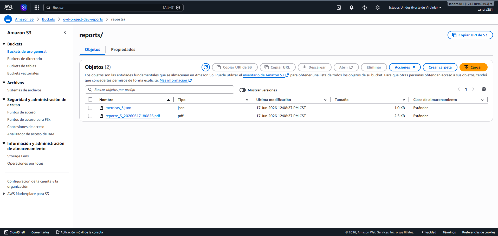

---

## Documentación

- [Delivery 1 — Resumen](docs/delivery-1-summary.md)
- [Delivery 2 — Resumen](docs/delivery-2-summary.md)
- [Delivery 3 — Resumen](docs/delivery-3-summary.md)
- [Delivery 4 — Resumen](docs/delivery-4-summary.md)

---

## Team

- Gabriela Lucia Navarro de León — 20000127
- Diego Alejandro Sican Olivares — 19001690
- Sandra Daniela Soria Palma — 20002619

Universidad Galileo — Postgrado en Diseño y Desarrollo de Software
