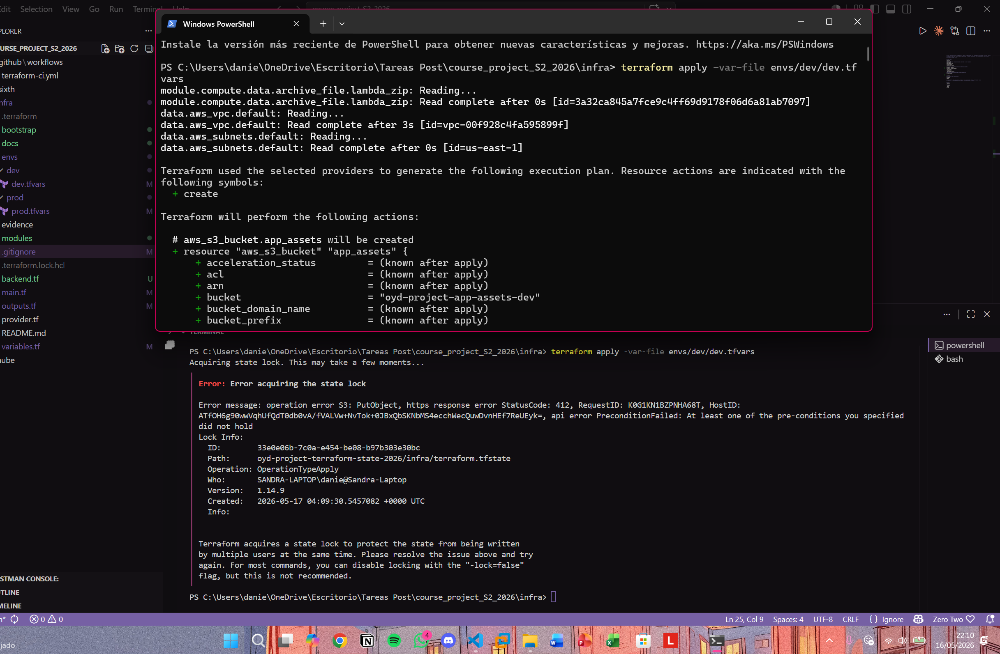

# Infraestructura — Sistema de Procesamiento de Ventas y Reportes (SPVR)

Este repositorio contiene la infraestructura como código del sistema SPVR, desarrollada con Terraform sobre AWS. La infraestructura se construye por entregas iterativas a lo largo del curso de Automatización con IaC.

---

## Estructura del repositorio

```
infra/
├── bootstrap/          # Workspace para provisionar el backend de state remoto
├── modules/
│   ├── compute/        # Módulo de Lambda para procesamiento de archivos
│   ├── storage/        # Módulo de S3 para archivos CSV y reportes PDF
│   └── database/       # Módulo de RDS MySQL para metadata y estados de jobs
├── envs/
│   └── dev/            # Variables del ambiente de desarrollo
│   └── prod/           # Variables del ambiente de produción
├── evidence/           # Evidencias de recursos desplegados
├── docs/               # Documentación y resúmenes de cada entrega
├── backend.tf          # Configuración del backend remoto en S3
├── main.tf             # Root module — llama a los tres módulos
├── variables.tf        # Variables del workspace principal
└── outputs.tf          # Outputs del workspace principal
```

---

## Proveedor y región

| Parámetro | Valor |
|---|---|
| Proveedor | AWS |
| Región | us-east-1 (Norte de Virginia) |
| Terraform | ~> 1.8 |
| AWS Provider | ~> 5.0 |

---

## Recursos desplegados

### Delivery 1 — Workspace y CI Pipeline
- Bucket S3 `oyd-project-app-assets-dev` con versionado y encriptación

### Delivery 2 — Cómputo, Almacenamiento y Base de Datos
- **Lambda** `oyd-project-dev-file-processor` — procesamiento de archivos CSV
- **S3** `oyd-project-dev-files` — almacenamiento de archivos CSV de entrada
- **S3** `oyd-project-dev-reports` — almacenamiento de reportes PDF generados
- **RDS MySQL** `oyd-project-dev-db` — metadata de jobs, estados y registro de errores
- **S3** `oyd-project-terraform-state-2026` — state remoto de Terraform
- **DynamoDB** `oyd-project-terraform-locks-2026` — locking del state

---

## Backend remoto

El state de Terraform se almacena en S3 con locking nativo de S3.
El workspace de bootstrap en `infra/bootstrap/` provisiona estos recursos con
state local y `prevent_destroy = true` para evitar destrucciones accidentales.

| Recurso | Nombre |
|---|---|
| Bucket S3 | `oyd-project-terraform-state-2026` |
| Región | `us-east-1` |

---

## Cómo aplicar

```bash
# Inicializar el workspace
terraform init

# Ver el plan de cambios
terraform plan -var-file envs/dev/dev.tfvars

# Aplicar los cambios
terraform apply -var-file envs/dev/dev.tfvars
```

---

## Evidence

### Compute — Lambda Desplegada

Evidencia de que la función Lambda `oyd-project-dev-file-processor` está
desplegada y activa en AWS (`us-east-1`):

```json
{
    "FunctionArn": "arn:aws:lambda:us-east-1:121218949493:function:oyd-project-dev-file-processor",
    "State": "Active"
}
```

Archivo completo: [evidence/compute-deployed.txt](evidence/compute-deployed.txt)

### Remote State — Lock Contention

Evidencia de que el mecanismo de locking rechaza aplicaciones concurrentes.
Al intentar correr `terraform apply` simultáneamente desde dos terminales,
la segunda terminal recibe el siguiente error:



---

## Documentación

- [Delivery 1 — Resumen](docs/delivery-1-summary.md)
- [Delivery 2 — Resumen](docs/delivery-2-summary.md)
---
## Nota sobre red
Para el Delivery 2 se utiliza la VPC default de AWS (vpc-00f928c4fa595899f) 
como placeholder. En el Delivery 3 se migrará a una VPC propia con subnets 
públicas y privadas, separando correctamente la capa de cómputo de la base de datos.